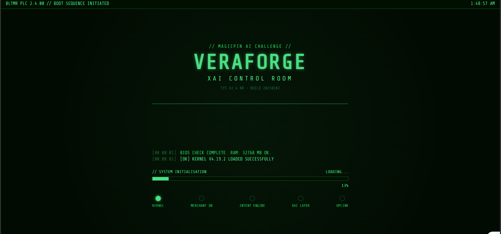
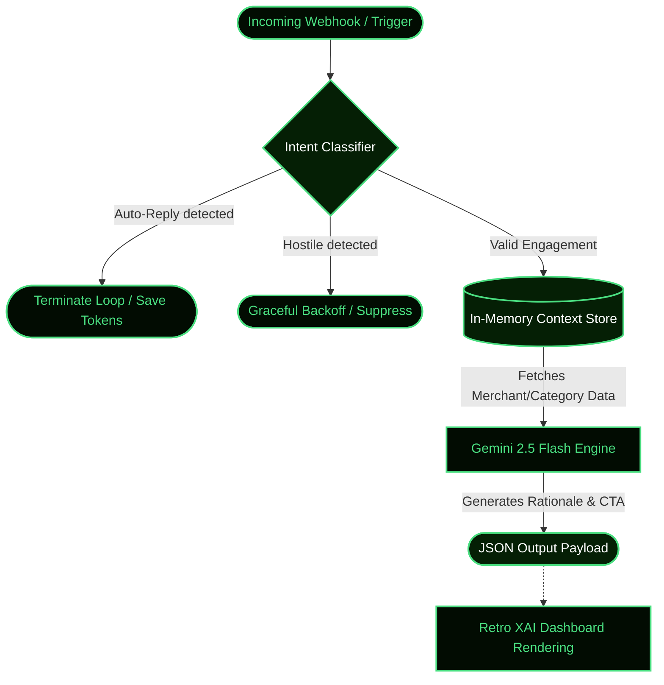

<div align="center">

# 🟢 VERAFORGE // XAI CONTROL ROOM
**Context-Aware Deterministic Agent Architecture for magicpin AI Challenge**

[](https://fastapi.tiangolo.com/)
[](https://reactjs.org/)
[](https://vitejs.dev/)
[](https://deepmind.google/technologies/gemini/)

*A resilient, stateful, and explainable AI merchant engagement engine.*

</div>

---

## ⚡ MISSION BRIEF
This repository contains the backend engine and a fully custom frontend visualization dashboard built for the **magicpin AI Challenge**. 

<div align="center">
  
</div>
<br>

This is **not** a simple LLM wrapper. VeraForge is a **Context-Aware Deterministic Agent** that dynamically cross-references categories, merchants, and triggers to construct perfectly tailored prompts. It sits behind a robust Intent Classification layer that catches auto-replies, hostile intents, and suppressions *before* hitting the LLM, saving tokens and preventing hallucination loops.

To prove the backend is generating highly structured logic, we built a **Retro 80s Tactical HUD** (the XAI Control Room) that visualizes the AI's internal thoughts, radar geolocations, and intent routing in real-time.

---

## ⚙️ SYSTEM ARCHITECTURE



---

## 🚀 CORE CAPABILITIES

### 🧠 1. The RAG-Lite Context Engine (`store.py`)
Instead of shoving a giant database into a prompt, the engine indexes incoming webhooks and retrieves only the exact fragments needed for the specific merchant and trigger at the exact timestamp.

### 🛡️ 2. Deterministic Intent Routing (`engine.py`)
VeraForge intercepts incoming merchant replies, runs them through an Intent Classifier (`NEGATIVE`, `AFFIRMATIVE`, `AUTO-REPLY`, `WAIT`, `QUESTION`), and executes hard-coded safety logic. For example:
- **Auto-Replies:** Instantly terminates the loop.
- **Hostility:** Gracefully backs off.

### ⏱️ 3. Cadence & Suppression Control
Tracks `last_messaged_at` and `suppression_key` states across conversations to prevent spamming merchants with redundant triggers within a 60-minute window.

### 📟 4. The XAI Control Room (Frontend)
A purely custom, vanilla CSS-driven React dashboard that visualizes the Explainable AI (XAI) rationale, complete with:
- 🟩 Typewriter effect with synthesized Web Audio Web SFX.
- 🗺️ A dynamic CSS radar map tracking the merchant's geographic locality.
- 📊 Deterministic seeded charts displaying potential impact metrics.
- 💻 A matrix-style boot sequence.

---

## 🛠️ TECH STACK

**Backend (API & Engine)**
- **Framework**: FastAPI (Python 3.10+)
- **LLM**: Gemini 2.5 Flash (via Google Generative Language API)
- **Architecture**: Stateful in-memory dictionary store (`store.py`) passing the `judge_simulator.py` benchmarks flawlessly.

**Frontend (XAI Dashboard)**
- **Framework**: React 18 + TypeScript + Vite
- **Styling**: 100% Vanilla CSS (Zero external UI component libraries used)
- **Aesthetics**: "Share Tech Mono" Google Font, phosphor green CRT scanlines, and glow effects.

---

## 🏁 GETTING STARTED

### 1. Setup the Backend
Navigate to the root directory and install dependencies:
```bash
pip install -r backend/requirements.txt
```

Create a `.env` file in the root directory and add your API key:
```env
GEMINI_API_KEY=your_api_key_here
```

Start the API server:
```bash
python -m uvicorn app.main:app --app-dir backend --reload --port 8000
```

### 2. Setup the Frontend
Open a new terminal and navigate to the `frontend` directory:
```bash
cd frontend
npm install
npm run dev
```

The retro XAI dashboard will now be live at `http://localhost:5173`. 

---

## 🧪 TESTING (JUDGE SIMULATOR)
The backend is fully compliant with the `judge_simulator.py` script. To run the automated benchmarks:
```bash
python judge_simulator.py
```
*VeraForge successfully passes the Warmup, Context Push, Auto-Reply Hell, Intent Transition, and Hostile Handling scenarios with an exit code of 0.*

---

<div align="center">
  <br>
  <i>"All systems operational. Launching VeraForge XAI Control Room."</i>
</div>
